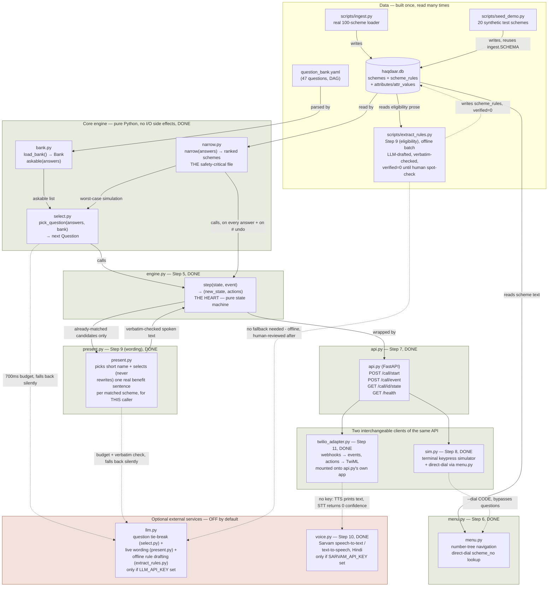

# Haqdaar Voice — how the files connect

This is the map to come back to whenever something breaks and it's not
obvious which file is responsible. It reflects the code as it actually
exists right now (Steps 0-11 done), not the original build plan.

For click-through demos of the system actually running, see `demos/` —
`step5_system_flow.html` (the state machine), `step6_menu_demo.html`
(browse + dial codes), and `step78_api_sim_demo.html` (real HTTP calls
against a live server, the M-series scenarios, and the concurrency proof).

## The mental model in one paragraph

A caller's answers accumulate in a plain dict (`answers`). Every turn, two
independent systems look at that dict: `narrow.py` asks the database "given
these answers, which schemes still qualify?" and `select.py` asks the
question bank "given these answers, what's the single best next question?"
Neither ever talks to the phone system directly — that's `engine.py`'s job,
which wraps both of them in a pure `step(state, event) -> (new_state,
actions)` function that `api.py` exposes over HTTP, and that either
`sim.py` (a terminal fake) or a real Twilio call (`twilio_adapter.py`,
mounted onto the same app) can drive identically — the adapter adds zero
engine logic, it only translates Twilio's webhook payloads into the same
events `sim.py` sends, and translates `step()`'s actions into TwiML
instead of terminal output. Once schemes are narrowed down enough to present,
`present.py` optionally asks an LLM to pick a short name and the single
most relevant real sentence to speak for each one — but it is never
allowed to decide *which* schemes qualify (that stays `narrow.py`'s job,
deterministic SQL) or to say anything that isn't a verbatim, mechanically-
checked quote from the scheme's own database row.

## Diagram

## File-by-file, in the order data flows

| File | Status | What it actually does |
|---|---|---|
| `question_bank.yaml` | done | The 47 questions a caller can be asked, and the rules for which question can follow which answer. Pure data, no code. |
| `attribute_seed.sql` | done | Dictionary of every attribute a question can write (`persona`, `age_band`, ...) and, for banded attributes, their sort order (`ord`) so "age 18-40 or older" comparisons work correctly. |
| `scripts/ingest.py` | done | Loads the real 100-scheme catalogue into `haqdaar.db`. Also defines the live database schema (the actual source of truth — the standalone `.sql` files in the repo root are superseded references, not what's loaded). |
| `scripts/seed_demo.py` | done | Builds a 20-scheme *synthetic* database with realistic eligibility rules, used only by the test suite and the demo artifacts. |
| `scripts/extract_rules.py` | done | Step 9 (eligibility half), one-time offline batch: reads each real scheme's eligibility prose, asks an LLM to propose structured `scheme_rules` constrained to the known attribute vocabulary, then mechanically rejects any rule whose `source_quote` isn't a verbatim match in the source text or whose attribute/value/op isn't in the allowed set before writing anything. Writes with `verified=0` — a human still checks a sample before flipping that bit, same as the original hand-authoring plan, just LLM-assisted instead of fully manual. Not run per-call. |
| `src/haqdaar/db.py` | done | One function: open a SQLite connection with sane defaults. Nothing else. |
| `src/haqdaar/bank.py` | done | Loads and validates `question_bank.yaml`. Answers one question: "given what's been answered so far, which questions are still askable?" |
| `src/haqdaar/narrow.py` | done | **The most safety-critical file in the project.** Given a dict of answers, returns every scheme that hasn't been *disproven* — an unanswered attribute never removes a scheme. Getting this backwards would silently hide schemes from callers who haven't been asked enough questions yet. |
| `src/haqdaar/select.py` | done | Given the askable questions and the current candidates, picks the single question that will narrow the list the most no matter which button the caller presses. Can optionally ask an LLM to break ties among the top 5 — but the LLM only ever sees question IDs and a one-line reason, never scheme names, and any bad/slow/missing response falls back to the deterministic top pick automatically. |
| `src/haqdaar/engine.py` | done | Owns the actual call state (what's been asked, what's been answered, how many candidates remain) and decides what happens on every keypress, including the global controls (`0`=restart, `*`=repeat, `#`=undo one answer, always re-running the narrowing so the candidate count is never stale) and the fallback ladders for silence, wrong buttons, and unclear speech. This is the file everything else routes through. |
| `src/haqdaar/llm.py` | done | The one place that actually makes an HTTP call to an LLM provider (OpenAI-compatible chat completions — currently pointed at Groq). Every other module that wants an LLM call goes through this, but nothing requires it to be present: `select.py` and `present.py` both take an injectable caller and default to a working, tested fallback with no key set. |
| `src/haqdaar/present.py` | done | Step 9 (wording half). For schemes that `narrow.py` has *already* matched (this file never touches eligibility), optionally asks an LLM to pick a short spoken name and select — never paraphrase — the single most relevant sentence from the scheme's own benefits text. Every LLM answer is checked to be an exact, byte-for-byte substring of the real database text before use; anything that fails that check (a paraphrase, an invented number, even a reformatted space) is thrown away and replaced with a safe deterministic default. This is what TEST_CASES.md's K2/K3 rule (spoken benefits must match the database exactly) looks like in code. |
| `src/haqdaar/menu.py` | done | Handles the "I already know the scheme's number" path — direct dial by 3-digit code (2-digit scheme number + 1-digit section), and the browse-by-category menu tree. Deliberately decoupled from `engine.py`'s question flow: a dial code jumps straight to a scheme's section text without going through any questions, so reshuffling the menu can never move a code someone wrote down (H11). |
| `src/haqdaar/api.py` | done | Exposes `engine.py` over plain HTTP endpoints (`/call/start`, `/call/event`, `/call/{id}/state`, `/health`), so any client (a terminal, a real phone system) can drive a call the same way. In-memory sessions only — caller answers are never written to disk. |
| `src/haqdaar/sim.py` | done | A terminal program that plays the role of a phone: prints what the system would say, accepts keypresses, and shows the call happening, talking to `api.py` over real HTTP exactly as `twilio_adapter.py` does. `--trace` shows the candidate count dropping turn by turn; `--dial CODE` demonstrates the direct-dial path. This is the actual runnable demo — see `demos/step78_api_sim_demo.html` for a recorded walkthrough, or run it live per the command in that file's "Health" tab. |
| `src/haqdaar/voice.py` | done | Step 10. Sarvam TTS/STT with a SHA1-keyed disk cache (`cache/tts/`) — every prompt is static text so after one `scripts/warm_cache.py` run almost no live Sarvam calls happen. No `SARVAM_API_KEY` → `tts()` returns `None` (caller prints text instead) and `stt()` returns `("", 0.0)`, which `engine.py`'s existing unclear-speech ladder already treats correctly with zero engine changes. |
| `src/haqdaar/twilio_adapter.py` | done | Step 11. A second FastAPI router, mounted onto `api.py`'s own app, translating Twilio's form-encoded voice webhooks into the exact same `step()` events `sim.py` sends, and `step()`'s actions into TwiML (`<Say>`/`<Gather>`/`<Hangup>`) instead of terminal output. Verifies `X-Twilio-Signature` via HMAC-SHA1 whenever `TWILIO_AUTH_TOKEN` is configured; skips verification (nothing to check against) when it isn't. No `twilio` SDK dependency — TwiML is hand-rolled XML, kept intentionally small. Adds nothing to the engine, per BUILD_STEPS.md's own rule for this step. |
| `scripts/warm_cache.py` | done | Pre-generates TTS audio for every static prompt in `question_bank.yaml` (question prompts + silence/speech/invalid policy text). Scheme benefit text from `present.py` is per-call, LLM-selected content, not a fixed prompt — it gets cached lazily on first real use instead. No-ops cleanly with no `SARVAM_API_KEY`. |

## Answering "when do the external services turn on?"

Nothing external is required for the system to work right now, and a full call completes with `.env` absent entirely (Step 8's L1 test, still true through Steps 10-11: no Sarvam key → prints instead of speaking; no Twilio account → drive the same engine via `sim.py` or raw webhook calls instead of a real phone number). See the one-liner roadmap below for exactly where each optional piece plugs in.
