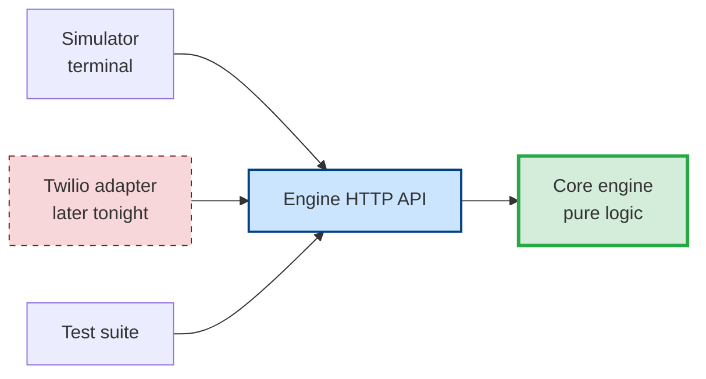
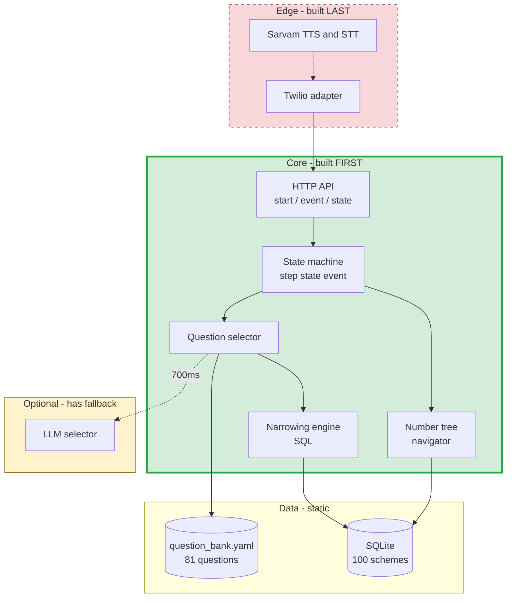
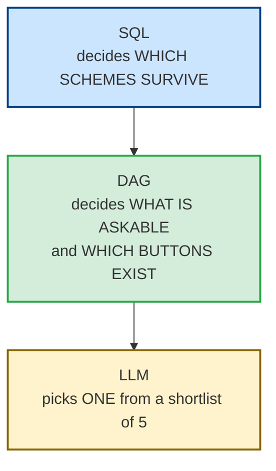
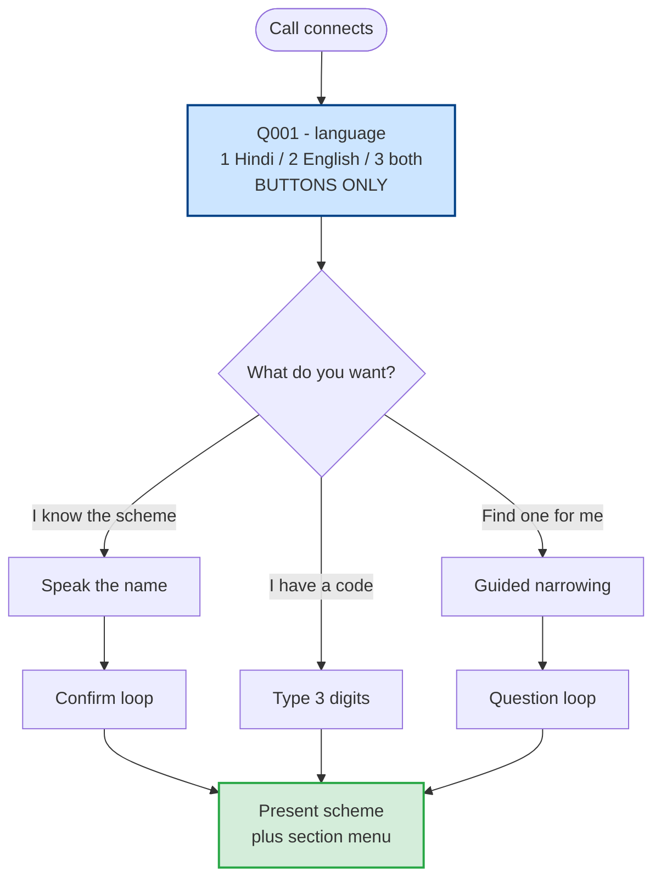
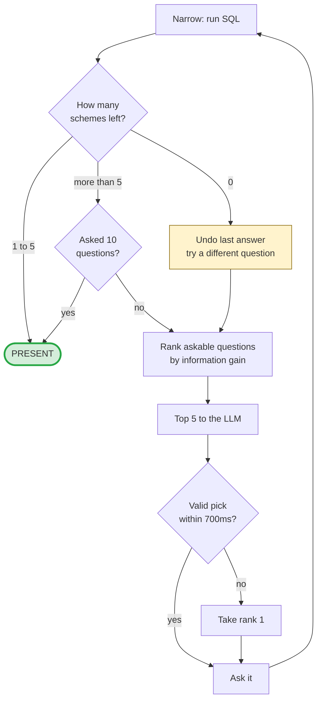
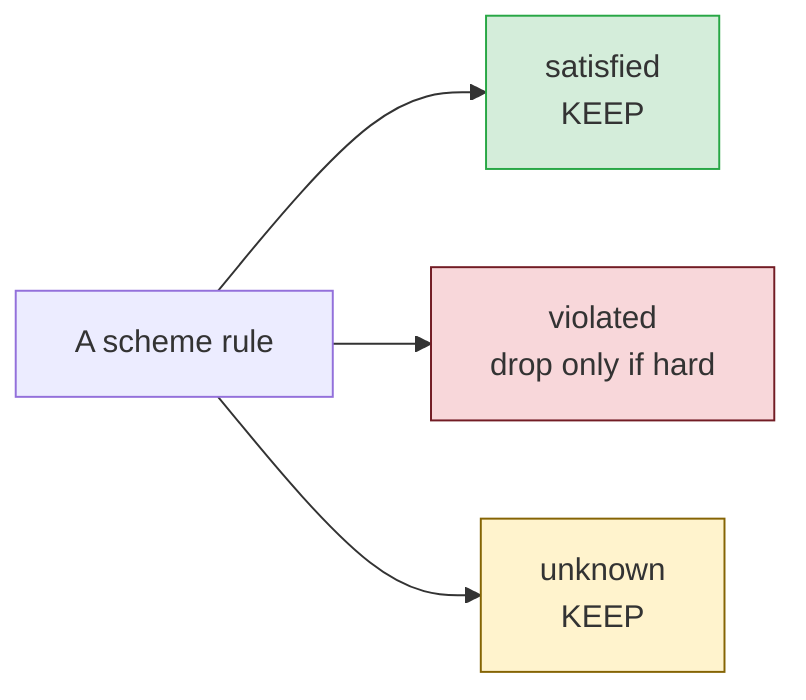
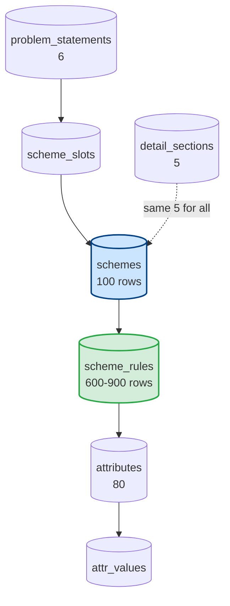
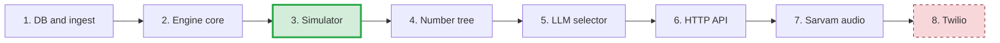

# Haqdaar Voice - System Design v4

**Status:** design locked, building the outer system
**Scope of this version:** everything EXCEPT telephony
**Date:** 8 Aug 2026

---

## 0. What changed from v3

| Change | Why |
|---|---|
| Three-level **number tree** replaces flat scheme numbers | Never more than 6 spoken options at any level |
| **Telephony pushed behind an adapter** | Build and test the whole system with no phone |
| Engine exposes an **HTTP API** | Simulator and Twilio become two clients of one engine |
| `district_scope` column added | Groundwork for `future/06` |
| Key setup documented, all keys optional | No external service can block the demo |

---

## 1. The one idea that matters

**The engine does not know what a phone is.**

It receives events (a key was pressed, someone said this, nobody spoke) and
returns actions (say this, collect a key, hang up). Whether those events came
from a terminal or a telephone is somebody else's problem.



This is why we build the outer system first. Telephony is I/O. The logic is
the product. And if Twilio misbehaves at 5 AM, we still have a demo.

---

## 2. Components



---

## 3. The three authorities

This has not changed since v1 and it is the backbone of the whole thing.



**The LLM never writes SQL, never names a scheme, never invents a button.**
It chooses one item from a list of five that the engine already approved. The
worst thing it can do is choose a slightly less efficient question. It cannot
hallucinate a benefit, because it never generates scheme text - all spoken
scheme content comes verbatim from the database.

---

## 4. The number tree

```mermaid
graph TB
    MAIN[Main menu<br/>6 problem statements]

    MAIN -->|1| P1[Vyapar, udyog ya dukaan  (52)]
    MAIN -->|2| P2[Bunkar, coir ya dastkari  (13)]
    MAIN -->|3| P3[Machhli palan ya nauka  (9)]
    MAIN -->|4| P4[Prashikshan ya rozgar  (10)]
    MAIN -->|5| P5[Kheti ya baagwani  (6)]
    P1 --> N{{Business: 6 need groups}}
    MAIN -->|6| P6[Pension, madad ya padhai  (10)]

    P2 -->|1| S1[Scheme A]
    P2 -->|2| S2[Scheme B]
    P2 -->|3| S3[Scheme C]
    P2 -->|4| S4[Scheme D]
    P2 -->|5| S5[Scheme E]

    S3 -->|1| D1[kya milega]
    S3 -->|2| D2[kaun le sakta hai]
    S3 -->|3| D3[kaunse kaagaz]
    S3 -->|4| D4[aavedan kaise]
    S3 -->|5| D5[yojna ke baare mein]

    style MAIN fill:#cce5ff,stroke:#004085,stroke-width:2px
    style S3 fill:#d4edda,stroke:#28a745
```

**6 x 5 x 5 = 150 addresses. We have 100 schemes. It fits with slack.**

The path `2 3 1` is also a **direct dial code**. A caller who noted down `231`
from a leaflet or a previous call types it at the main menu and lands straight
on what they get for that scheme. Same tree, no second system.

**Section keys 1-5 are identical for every scheme in the catalogue.** The
caller learns the menu once. We record that audio once. This is the single
biggest reason to keep the sections fixed rather than per-scheme.

> **Once a code is assigned, it never changes.** Codes get spoken aloud and
> written down. Reshuffling them silently breaks every caller who noted one.

### Digits are spoken as digits

"do teen ek", never "two hundred thirty one". Unambiguous in every language,
and it survives bad audio.

---

## 5. Two ways in



---

## 6. The question loop



**Stop when 5 or fewer schemes remain, or after 10 questions.**
Typical call: 5-6 questions. There is **no elapsed-time cutoff** - a caller
mid-answer is never cut off by a clock.

**Zero candidates is recoverable.** We undo the last answer and ask something
else rather than telling someone there is nothing for them.

---

## 7. Three-valued matching

The rule that makes the whole thing safe:



**An unanswered question never eliminates a scheme.** Silence is not a no.
If we have not asked about land, every land-related scheme stays alive.

The cost of showing one extra scheme is a few seconds. The cost of hiding the
right one is the entire point of the product.

---

## 8. Global keys - fixed everywhere, never announced

| Key | Action |
|---|---|
| `0` | Main menu - back to language, wipe answers |
| `*` | Repeat whatever was just said |
| `#` | Back - undo last answer, re-ask previous question |
| `1`-`9` | Answer options |

`#` must undo the answer **and** re-run the matcher. Undoing the answer while
leaving the candidate list narrowed is the nastiest possible bug here, because
it is invisible - the call sounds fine and the result is wrong.

`*` needs a `last_spoken` buffer, not just the current question, because a
caller says repeat most often after an *answer*.

---

## 9. When things go wrong

```mermaid
graph TB
    subgraph SIL["Silence - 30s total"]
        T1[5s: gentle nudge] --> T2[15s: two options only]
        T2 --> T3[25s: Kya aap line par hain?]
        T3 --> T4[30s: end politely]
    end

    subgraph SPE["Unclear speech - 2 tries"]
        U1[Mujhe samajh nahi aaya.<br/>Dobara boliye.] --> U2[Second try]
        U2 --> U3[Koi baat nahi.<br/>Button se kariye.]
    end

    subgraph INV["Wrong button - 3 tries"]
        I1[Yeh button sahi nahi hai] --> I2[Replay options only]
        I2 --> I3[Collapse to 2 options]
    end

    style T4 fill:#f8d7da,stroke:#721c24
    style U3 fill:#d4edda,stroke:#28a745
    style I3 fill:#d4edda,stroke:#28a745
```



Two of these three ladders end in **success**, not failure. Speech trouble
falls back to buttons. Button trouble falls back to a two-option menu that is
almost impossible to get wrong. Only silence ends the call, and it ends politely.

**Never a silent hangup. Never hold music. Never guess on low confidence.**

---

## 10. The engine contract

One function. Everything else is plumbing.

```
step(state, event) -> (new_state, actions)

event   = { dtmf } | { speech, confidence } | { timeout } | { hangup }
actions = [ say | gather | end ]
```

**Pure and deterministic.** Same state plus same event always gives the same
result. That is what makes it testable without a phone, and it is why a whole
call can be replayed from its event log.

### HTTP surface

| Endpoint | Purpose |
|---|---|
| `POST /call/start` | New session, returns first actions |
| `POST /call/event` | Feed one event, returns next actions |
| `GET /call/{id}/state` | Inspect - debugging and tests |
| `GET /health` | Is the DB loaded, is the bank valid |

The Twilio adapter is then a thin translator: webhook to event, actions to
TwiML. Nothing in the core changes when it arrives.

---

## 11. Data model



`scheme_rules` is where the real work lives. Turning eligibility prose into
rules is the slowest task in the project and the one that decides whether
answers are correct.

**Caller answers live in memory for the duration of the call and are never
written to disk.**

---

## 12. Build order



**A working demo exists from step 3 onward.** Everything after that improves
it; nothing after that is required for it to run. That ordering is the whole
risk strategy.

Detail in `BUILD_STEPS.md`.

---

## 13. What can still hurt us

| Risk | Mitigation |
|---|---|
| Scheme rules take longer than expected | Demo needs 20 good schemes, not 100 |
| No state field in the source JSON | Extract from prose; NULL means never eliminated |
| Hindi TTS unclear on 8 kHz phone audio | Test on a handset early; pre-cache clips |
| LLM slow or down | 700ms timeout, engine takes rank 1 |
| Twilio trial restrictions | Verify demo numbers now, not at 5 AM |
| Scheme names unspeakably long | `name_short_hi` written by hand at ingest |

Detail in `future/05_KNOWN_RISKS.md`.
